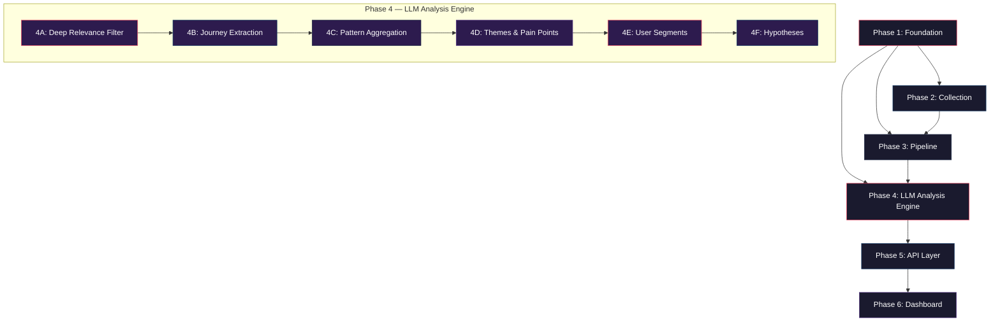

# Google Photos AI Discovery Engine — Implementation Plan

> **Version:** V1  
> **Created:** 2026-09-25  
> **Architecture:** [Architecture.md](file:///h:/Antigravity/Google%20photo%20Discovery/Docs/Architecture.md)  
> **Context:** [Context.md](file:///h:/Antigravity/Google%20photo%20Discovery/Docs/Context.md)  
> **Status:** Draft

---

## Overview

This document defines the **phase-wise implementation plan** for the Google Photos AI Discovery Engine. Each phase builds on the previous one, producing a working, testable increment. The plan is designed so that at the end of every phase, the system can be verified end-to-end for the functionality delivered so far.

### Phase Summary

| Phase | Name | Deliverable |
|---|---|---|
| **1** | Foundation & Infrastructure | Project scaffold, DB, Docker, shared types |
| **2** | Data Collection Layer | Working collectors for all 5+ sources |
| **3** | Processing Pipeline | Cleaning, deduplication, relevance filtering |
| **4** | LLM Analysis Engine | 6-step analysis: Relevance → Journey Extraction → Aggregation → Themes → Segments → Hypotheses |
| **5** | API Layer & Data Export | Full REST API, CSV/JSON export |
| **6** | Frontend Dashboard | Complete discovery dashboard with all sections |

> [!NOTE]
> Phases can overlap slightly where dependencies allow.

---

## Phase 1 — Foundation & Infrastructure

**Goal:** Establish the project scaffold, database, Docker environment, shared types, and configuration so all subsequent phases have a stable base to build on.

### 1.1 Project Initialization

| Task | Details |
|---|---|
| Initialize Node.js project | `npm init` with TypeScript support |
| Configure TypeScript | `tsconfig.json` — strict mode, ES2022 target, path aliases (`@/collectors`, `@/pipeline`, etc.) |
| Install core dependencies | `typescript`, `ts-node`, `dotenv`, `pino` (logging), `uuid` |
| Setup linting & formatting | ESLint + Prettier with TypeScript rules |
| Create `.env.example` | All environment variables from Architecture §10 |
| Create `.gitignore` | Standard Node + `.env` + `node_modules` + `dist` |

**Files to create:**

```
google-photos-discovery/
├── package.json
├── tsconfig.json
├── .env.example
├── .gitignore
├── .eslintrc.js
├── .prettierrc
└── src/
    └── index.ts              # Entry point (placeholder)
```

### 1.2 Docker Compose Environment

| Task | Details |
|---|---|
| Create `docker-compose.yml` | PostgreSQL 16 + Redis 7 + API service + Frontend service |
| Configure volumes | Persistent `pgdata` volume for PostgreSQL |
| Configure networking | All services on a shared Docker network |
| Add health checks | PostgreSQL and Redis readiness probes |

**Exact services** (from Architecture §11):

| Service | Image | Port |
|---|---|---|
| `postgres` | `postgres:16-alpine` | 5432 |
| `redis` | `redis:7-alpine` | 6379 |
| `api` | Custom build from `./` | 3001 |
| `frontend` | Custom build from `./frontend` | 3000 |

**Verification:** `docker compose up -d` starts PostgreSQL and Redis successfully. Connection can be tested with `psql` and `redis-cli`.

### 1.3 Database Setup

| Task | Details |
|---|---|
| Install `pg` + `@types/pg` | PostgreSQL client for Node.js |
| Create `src/db/connection.ts` | Connection pool using `DATABASE_URL` from `.env` |
| Create migration runner | Simple sequential SQL migration runner |
| Write migration `001_initial_schema.sql` | All tables from Architecture §3.1 — `raw_records`, `cleaned_records`, `relevance_classifications`, `analysis_results`, `hypotheses`, `hypothesis_evidence`, `processing_jobs` |
| Write all indexes | Per Architecture §3.1 |

**Database tables to create (in order):**

```
1. raw_records              — immutable raw collected data
2. cleaned_records          — normalized, deduped records
3. relevance_classifications — keyword/LLM classification results
4. analysis_results         — LLM structured extraction output
5. hypotheses               — generated research hypotheses
6. hypothesis_evidence      — links hypotheses to evidence
7. processing_jobs          — pipeline job tracking
```

**Verification:** Run migrations → confirm all 7 tables exist with correct columns, indexes, and constraints.

### 1.4 Shared Types & Utilities

| Task | Details |
|---|---|
| Create `src/shared/types.ts` | TypeScript types for `RawRecord`, `CleanedRecord`, `AnalysisResult`, `Hypothesis`, `ProcessingJob`, etc. |
| Create `src/shared/constants.ts` | Source names, failure point codes (A–G), classification enums, processing status values |
| Create `src/shared/utils.ts` | Deterministic `record_id` generator (hash of `source + source_url + raw_text`), date helpers, sanitizers |
| Create `src/shared/logger.ts` | Pino structured logger configuration |

**Key type definitions:**

```typescript
// Failure point codes — must match Context §7
type FailurePoint = 'A' | 'B' | 'C' | 'D' | 'E' | 'F' | 'G' | 'unknown' | 'multiple';

// Classification values — must match Context §5.1
type RelevanceClassification = 'relevant' | 'potentially_relevant' | 'irrelevant';

// Processing status lifecycle
type ProcessingStatus = 'pending' | 'processing' | 'completed' | 'failed' | 'retry';

// Final outcome — must match Context §6
type FinalOutcome = 'found' | 'not_found' | 'abandoned' | 'unknown';

// Frustration signal levels
type FrustrationSignal = 'low' | 'medium' | 'high' | 'unknown';
```

### 1.5 Job Queue Setup

| Task | Details |
|---|---|
| Install `bullmq` + `ioredis` | BullMQ for job queue, ioredis for Redis connection |
| Create `src/jobs/queue.ts` | Queue initialization, default job options (retry, backoff) |
| Create `src/jobs/worker.ts` | Base worker setup with error handling |
| Install `@bull-board/express` | Queue monitoring dashboard |

**Queue definitions:**

| Queue Name | Purpose | Default Concurrency |
|---|---|---|
| `collection` | Source data collection jobs | 2 |
| `cleaning` | Cleaning & deduplication | 5 |
| `classification` | Relevance classification | 3 |
| `extraction` | LLM structured extraction | 2 |
| `hypothesis` | Hypothesis generation | 1 |

### 1.6 Repository Layer

| Task | Details |
|---|---|
| Create `src/db/repositories/raw-records.ts` | `insert`, `findByRecordId`, `findBySource`, `count`, `findUnprocessed` |
| Create `src/db/repositories/cleaned-records.ts` | `insert`, `findNonDuplicates`, `findBySource`, `count` |
| Create `src/db/repositories/analysis-results.ts` | `insert`, `updateStatus`, `findByFailurePoint`, `findBySegment`, `aggregateByFailure`, `aggregateBySource` |
| Create `src/db/repositories/segments.ts` | `insert`, `findAll`, `linkEvidence`, `findEvidenceForSegment` |

**Verification:** Unit tests confirming CRUD operations against a test database.

### Phase 1 — Exit Criteria

- [ ] `docker compose up` starts PostgreSQL 16 and Redis 7
- [ ] All 7 database tables created with correct schema
- [ ] TypeScript compiles cleanly with strict mode
- [ ] Repository layer can insert and query all tables
- [ ] BullMQ queues initialized and visible on Bull Board
- [ ] Pino logger produces structured JSON logs
- [ ] `.env.example` documents all required environment variables

---

## Phase 2 — Data Collection Layer

**Goal:** Build working collectors for all primary data sources (Google Play, App Store, Reddit, YouTube, Google Community) using the standardized `ISourceCollector` interface, plus a collector registry to manage them.

### 2.1 Collector Interface & Registry

| Task | Details |
|---|---|
| Create `src/collectors/interfaces.ts` | `ISourceCollector`, `CollectionOptions`, `RawRecord` interfaces (from Architecture §7) |
| Create `src/collectors/registry.ts` | Collector registry — register/get collectors by source name |
| Create base collector class | Shared logic: rate limiting, retry, logging, record ID generation |

**Interface definition** (from Architecture §7):

```typescript
interface ISourceCollector {
  readonly sourceName: string;
  collect(options: CollectionOptions): AsyncGenerator<RawRecord>;
  healthCheck(): Promise<boolean>;
}
```

### 2.2 Google Play Store Collector

| Task | Details |
|---|---|
| Install `google-play-scraper` | Unofficial scraper for public reviews |
| Create `src/collectors/google-play.ts` | Implements `ISourceCollector` |
| Configure app ID | `com.google.android.apps.photos` |
| Implement rate limiting | 1–2 req/sec with randomized delays |
| Implement pagination | Token-based continuation (library handles this) |
| Generate deterministic `record_id` | Hash of `source + source_url + raw_text` |
| **Capture review permalink** | Each review must have a direct URL back to the original review |

**Data to extract per review:**
- Review text, rating (1–5), date, thumbsUp count, reviewer name, reply text, **review permalink**

### 2.3 Apple App Store Collector

| Task | Details |
|---|---|
| Install `app-store-scraper` | Unofficial scraper for public reviews |
| Create `src/collectors/app-store.ts` | Implements `ISourceCollector` |
| Configure app ID | Google Photos iOS app ID |
| Implement rate limiting | 1 req/sec |
| Implement pagination | Page-based |
| **Capture review permalink** | Each review must have a direct URL back to the original review |

**Data to extract per review:**
- Review text, rating, date, title, version, author, **review permalink**

### 2.4 Reddit Collector

| Task | Details |
|---|---|
| Implement Reddit OAuth2 flow | Using `REDDIT_CLIENT_ID`, `REDDIT_CLIENT_SECRET` |
| Create `src/collectors/reddit.ts` | Implements `ISourceCollector` |
| Configure target subreddits | `r/googlephotos`, `r/Android`, `r/iphone`, `r/photography`, `r/google`, `r/Pixel`, `r/degoogle`, `r/techsupport` |
| Configure search queries | `"google photos search"`, `"can't find photo"`, `"find old photo google photos"`, `"google photos not finding"`, `"search doesn't work google photos"` |
| Implement rate limiting | 100 requests/minute (OAuth limit) |
| Implement pagination | Cursor-based (`after` token) |
| Collect threaded comments | For relevant posts, also collect comment threads |
| **Capture permalinks** | Each post and individual comment must have a direct URL |

**Endpoints to use:**
- `/search` — global search
- `/r/{subreddit}/search` — subreddit-specific search
- `/comments/{id}` — fetch comment threads

**Data to extract per post/comment:**
- Post title, body, comments (threaded), score, date, author, **permalink to post and individual comments**

### 2.5 YouTube Comments Collector

| Task | Details |
|---|---|
| Configure YouTube Data API v3 | Using `YOUTUBE_API_KEY` |
| Create `src/collectors/youtube.ts` | Implements `ISourceCollector` |
| Implement two-step collection | Step 1: `search.list` → find relevant videos. Step 2: `commentThreads.list` → collect comments |
| Budget quota management | Search = 100 units, commentThreads = 1 unit. Daily budget: 10,000 units |
| Configure search queries | `"google photos search tips"`, `"find old photos google photos"`, `"google photos can't find"`, `"google photos AI search"` |
| **Capture comment permalinks** | Each comment must have a direct URL constructed from video ID + comment ID |

**Data to extract per comment:**
- Comment text, like count, date, author, reply count, video ID/title, **comment permalink**

### 2.6 Google Support Community Collector

| Task | Details |
|---|---|
| Install Playwright | Headless browser for web scraping |
| Create `src/collectors/google-community.ts` | Implements `ISourceCollector` |
| Target | `support.google.com/photos/community` |
| Implement rate limiting | 1 req/2sec, respect `robots.txt` |
| Search strategy | `"can't find photo"`, `"search not working"`, `"find old photos"`, `"search results wrong"` |
| Extract thread structure | Thread title, question body, replies, date, marked answers |
| **Capture thread URL** | Each thread must have a direct URL back to the original thread |

### 2.7 Collection Job

| Task | Details |
|---|---|
| Create `src/jobs/collection-job.ts` | BullMQ job processor for collection tasks |
| Register per-source jobs | Each source gets its own repeatable job |
| Implement idempotency | Skip records where `record_id` already exists in `raw_records` |
| Track job progress | Update `processing_jobs` table with counts, status, errors |
| Log structured output | Source, records collected, duplicates skipped, errors |

### Phase 2 — Exit Criteria

- [ ] All 5 collectors implement `ISourceCollector` and are registered
- [ ] Each collector's `healthCheck()` returns `true` when the source is reachable
- [ ] Google Play collector successfully fetches ≥100 reviews
- [ ] Reddit collector authenticates and fetches posts + comments from target subreddits
- [ ] YouTube collector fetches comments within daily quota budget
- [ ] Google Community collector scrapes threads with full text
- [ ] All collected records are stored in `raw_records` with correct schema
- [ ] Re-running collection does not create duplicate records (deterministic `record_id`)
- [ ] `processing_jobs` table shows accurate job status

---

## Phase 3 — Processing Pipeline

**Goal:** Build the cleaning, deduplication, and relevance filtering pipeline that transforms raw records into cleaned, classified records ready for LLM analysis.

### 3.1 Cleaning & Normalization

| Task | Details |
|---|---|
| Create `src/pipeline/cleaner.ts` | Text cleaning and normalization module |
| Strip HTML | Remove HTML tags, entities, tracking params, nav noise |
| Normalize whitespace | Collapse multiple spaces/newlines, trim, fix encoding |
| Normalize dates | Convert all dates to ISO 8601 format |
| Detect language | Use a lightweight language detection library (e.g., `franc`) |
| Flag short records | Records < 20 chars flagged as skip |
| Preserve original | Raw text is never modified — cleaning produces a new `cleaned_text` |
| Store cleaning metadata | Record what was removed/normalized in `cleaning_meta` JSONB field |

**Cleaning rules (from Context §5.2):**

```
REMOVE:
  ✓ HTML remnants, tracking parameters, malformed markup
  ✓ Spam, bot-generated content
  ✓ Empty records, extremely short records (< 20 chars)
  ✓ Navigation/UI noise, advertisements

NORMALIZE:
  ✓ Whitespace, encoding, punctuation
  ✓ Dates → ISO 8601
  ✓ Source names, language metadata
  ✓ URLs, timestamps

PRESERVE:
  ✗ Do NOT aggressively rewrite user text
  ✗ Original text must remain available for evidence
```

### 3.2 Deduplication Engine

| Task | Details |
|---|---|
| Create `src/pipeline/deduplicator.ts` | Fuzzy deduplication module |
| Implement MinHash / Jaccard similarity | Threshold: > 0.85 similarity = duplicate |
| Install `minhash` or equivalent | Locality-sensitive hashing for efficient comparison |
| Mark duplicates | Set `is_duplicate = true` on `cleaned_records` |
| Keep earliest record | If duplicates found, keep the earliest by `source_date` |
| Cross-source dedup | Detect duplicates across different sources (e.g., same text on Reddit and a forum) |

### 3.3 Relevance Filtering — Pass 1 (Keyword/Heuristic)

| Task | Details |
|---|---|
| Create `src/pipeline/relevance-filter.ts` | Two-pass relevance classification |
| Implement keyword matching | Case-insensitive matching against curated keyword lists |
| Store classification | Insert into `relevance_classifications` table |

**Keyword lists (from Architecture §5.3):**

```
RELEVANT KEYWORDS:
  "can't find", "search", "looking for photo", "find old photo",
  "search not working", "can't locate", "retrieve",
  "where is my photo", "remember a photo", "search results",
  "find a specific"

IRRELEVANT KEYWORDS:
  "storage full", "backup", "subscription", "pricing",
  "sync", "sharing", "editing", "account locked",
  "payment", "Google One"
```

**Classification logic:**
- Matches relevant keywords → `potentially_relevant`
- Matches only irrelevant keywords → `irrelevant`
- Ambiguous (matches both or neither) → `potentially_relevant`

### 3.4 Relevance Filtering — Pass 2 (LLM Classification)

| Task | Details |
|---|---|
| Extend `src/pipeline/relevance-filter.ts` | LLM-based classification for `potentially_relevant` records |
| Batch records | Send 10–20 records per LLM call |
| Use classification prompt | Architecture §8.1 prompt template |
| Store LLM classification | Update `relevance_classifications` with `classification_method = 'llm'` |
| Track costs | Only ambiguous records go to LLM — cost-efficient |

### 3.5 Cleaning Job

| Task | Details |
|---|---|
| Create `src/jobs/cleaning-job.ts` | BullMQ job: picks unprocessed `raw_records`, runs cleaner → deduplicator → stores `cleaned_records` |
| Create `src/jobs/classification-job.ts` | BullMQ job: picks unclassified `cleaned_records`, runs Pass 1 → Pass 2 |
| Track progress | Update `processing_jobs` table |

### 3.6 Pipeline Orchestrator

| Task | Details |
|---|---|
| Create `src/pipeline/orchestrator.ts` | Coordinates the full pipeline: collect → clean → classify → extract |
| Sequential stage execution | Each stage waits for the previous stage's batch to complete before starting |
| Status tracking | Query `processing_jobs` for current pipeline state |
| Incremental processing | Only process records not yet processed by the current stage |

### Phase 3 — Exit Criteria

- [ ] Cleaner strips HTML, normalizes whitespace/dates, detects language
- [ ] Deduplicator identifies duplicates with Jaccard > 0.85 and flags them
- [ ] Pass 1 keyword filter correctly classifies obvious relevant/irrelevant records
- [ ] Pass 2 LLM classification processes ambiguous records in batches
- [ ] `cleaned_records` table populated with correct links to `raw_records`
- [ ] `relevance_classifications` table shows classification, confidence, method
- [ ] Pipeline is incremental — re-running does not reprocess already-processed records
- [ ] Pipeline orchestrator can trigger full collect → clean → classify flow

---

## Phase 4 — LLM Analysis Engine

**Goal:** Transform 13,000+ cleaned reviews into actionable research insights through a 6-step LLM analysis pipeline. Each step builds on the previous, progressively narrowing raw data into structured evidence, patterns, user segments, and testable research hypotheses.

> [!IMPORTANT]
> **Execution Model:** All Phase 4 steps run as **standalone TypeScript scripts** that read from JSON files and write to JSON files. No database or Redis dependency required. Each script supports **resume** (skips already-processed records) so it can be safely re-run after interruption.

### Phase 4 — Sub-Phase Overview

- [x] **4A** - Deep Relevance Filter (Code complete, rate-limited)
- [x] **4B** - User Journey Extraction (Completed with 111 journeys)
- [x] **4C** - Pattern Aggregation (Completed)
- [x] **4D** - Theme & Pain Point Discovery (Completed with 4 themes)
- [x] **4E** - User Segment Synthesis (Completed with 4 segments)
- [x] **4F** - Hypothesis Generation (Completed with 6 hypotheses)

| Step | Name | Input | Output | LLM? |
|---|---|---|---|---|
| **4A** | Deep Relevance Filter | `relevant_reviews.json` (13,252) | `phase4a_relevant.json` (~2,000–4,000) | Yes |
| **4B** | User Journey Extraction | `phase4a_relevant.json` | `phase4b_journeys.json` | Yes |
| **4C** | Pattern Aggregation | `phase4b_journeys.json` | `phase4c_aggregation.json` | No |
| **4D** | Theme & Pain Point Discovery | `phase4c_aggregation.json` + evidence samples | `phase4d_themes.json` | Yes |
| **4E** | User Segment Synthesis | `phase4c_aggregation.json` + `phase4d_themes.json` + evidence | `phase4e_segments.json` | Yes |
| **4F** | Hypothesis Generation | All previous outputs | `phase4f_hypotheses.json` | Yes |


### 4.0 LLM Infrastructure (Shared Across All Steps)

| Task | Details |
|---|---|
| Create `src/llm/client.ts` | LLM client using Groq API (`groq-sdk`), structured JSON output, configurable model |
| Create `src/llm/batch-manager.ts` | Batch processing with configurable size (default 15), sequential execution, 2s inter-batch delay |
| Create `src/llm/prompts/` directory | Versioned prompt files, each exporting `PROMPT_VERSION` constant |
| Configure from `.env` | `GROQ_API_KEY`, `GROQ_MODEL` (default `llama-3.3-70b-versatile`), `LLM_BATCH_SIZE`, `LLM_MAX_RETRIES` |

**Retry strategy:**

```
Attempt 1 → immediate
Attempt 2 → wait 5 seconds
Attempt 3 → wait 15 seconds
After 3 failures → mark as 'failed', log error, skip record, continue batch
```

**Prompt versioning convention:**
- Format: `v{major}.{minor}` — e.g., `v1.0`, `v1.1`
- Every prompt change = new version
- `llm_prompt_version` stored per output record for reproducibility

---

### 4A — Deep Relevance Filter

**Goal:** From 13,252 cleaned reviews → only reviews that discuss **photo retrieval problems** (user trying to find/locate a specific photo or memory and struggling).

**Why this step exists:** The existing `relevant_reviews.json` was filtered by keyword/heuristic. It still contains reviews about storage, pricing, UI complaints, backup, sharing, etc. The LLM deeply reads each review to determine if it describes an actual photo-retrieval failure.

| Task | Details |
|---|---|
| Create `src/llm/prompts/classify-v2.ts` | Enhanced relevance classification prompt |
| Create `scripts/phase4a-relevance-filter.ts` | Standalone script: reads `relevant_reviews.json`, classifies each review via LLM, writes results |
| Batch processing | 15 reviews per LLM call |
| Resume support | Saves progress file `phase4a_progress.json` with processed record indices |
| Output splitting | Writes separate files for relevant, potentially relevant, and irrelevant |

**Classification prompt scope — what counts as "relevant":**

```
RELEVANT — The review describes ANY of:
  • User trying to find/search for a specific photo and failing
  • Search feature not returning expected results
  • User unable to locate a photo they know exists
  • Face recognition failures preventing photo discovery
  • Album/organization issues making photos unfindable
  • User scrolling endlessly because search doesn't work
  • Missing photos that user cannot retrieve
  • Any complaint about Google Photos search/find/retrieve capability

POTENTIALLY RELEVANT — Mentions search, finding, or locating photos
  but lacks enough detail to confirm a retrieval failure

IRRELEVANT — About storage, backup, pricing, sync, editing, sharing,
  UI design, performance, account issues — with NO retrieval component
```

**LLM output schema per review:**

```json
{
  "classification": "relevant | potentially_relevant | irrelevant",
  "confidence": 0.0,
  "reasoning": "brief explanation",
  "retrieval_signal": "what specifically suggests a retrieval problem (or null)"
}
```

**Output files:**

| File | Contents |
|---|---|
| `phase4a_relevant.json` | Reviews classified as `relevant` (estimated 2,000–4,000) |
| `phase4a_potentially_relevant.json` | Reviews classified as `potentially_relevant` |
| `phase4a_irrelevant.json` | Reviews classified as `irrelevant` |
| `phase4a_stats.json` | Counts, confidence distribution, classification breakdown |
| `phase4a_progress.json` | Resume checkpoint (processed indices) |

**Estimated API calls:** ~880 (13,252 ÷ 15 per batch)

---

### 4B — User Journey Extraction

**Goal:** For each relevant review, extract a structured map of the user's **photo-retrieval journey** — what they remember, what they forgot, how they searched, what happened, where they failed, and what they did after.

**Why this step exists:** We don't just want to know "search is broken." We need to understand WHERE in the retrieval journey each user fails. This structured extraction maps each review onto the retrieval journey framework (Problem Statement §3).

| Task | Details |
|---|---|
| Create `src/llm/prompts/journey-extract-v1.ts` | Journey extraction prompt with full schema |
| Create `scripts/phase4b-journey-extraction.ts` | Standalone script: reads `phase4a_relevant.json`, extracts structured journey per review |
| Batch processing | 1 review per LLM call (deep extraction requires full context window per review) |
| Resume support | Saves `phase4b_progress.json` with processed record IDs |
| Validation | Validates LLM output against schema, flags invalid extractions |

**Extraction schema — the retrieval journey map:**

```json
{
  "record_id": "string — unique identifier for traceability",
  "source": "google_play | app_store | youtube | reddit",
  "source_url": "original URL",
  "original_text": "preserved raw text for evidence",

  "retrieval_scenario": "what the user was trying to find (e.g., vacation photo, childhood photo, document)",

  "what_user_remembers": {
    "photo_type": "selfie | landscape | group | document | screenshot | other | null",
    "occasion": "vacation | birthday | wedding | everyday | holiday | other | null",
    "location": "specific place or general area mentioned | null",
    "people": "who is in the photo | null",
    "activity": "what was happening | null",
    "visual_details": "colors, objects, backgrounds mentioned | null",
    "time_period": "when approximately | null"
  },

  "what_user_forgot": ["exact date", "album name", "etc."],

  "search_journey": {
    "method_used": "keyword_search | face_search | manual_scroll | album_browse | date_browse | location_search | other",
    "query_attempted": "what they typed or searched for | null",
    "number_of_attempts": "number or null",
    "search_modifications": ["what they changed between attempts"]
  },

  "search_outcome": "what happened after searching",

  "failure_points": ["A", "B", "C", "D", "E", "F", "G"],
  "failure_description": "human-readable description of what went wrong",

  "user_behaviour_after": "what the user did after failing",
  "workaround": "any workaround the user tried or used | null",
  "final_outcome": "found | not_found | abandoned | unknown",

  "frustration_level": "low | medium | high | unknown",
  "frustration_signals": ["specific words or phrases indicating frustration"],

  "user_segment_signals": ["power_user | casual_user | parent | traveler | professional | long_term_user | new_user | etc."],

  "evidence_quote": "most important verbatim quote showing the failure",
  "confidence": 0.0
}
```

**Failure Point Framework (from Problem Statement §12):**

| Code | Failure Point | Description |
|---|---|---|
| **A** | Memory Expression | User has a memory but struggles to describe it |
| **B** | Query Formulation | User describes the memory but doesn't know what terms to search |
| **C** | Search Understanding | User submits a reasonable query but Google Photos doesn't understand the context |
| **D** | Result Relevance | Results don't contain the expected photo or are insufficiently relevant |
| **E** | Result Evaluation | Too many results make it hard to find the correct photo |
| **F** | Search Recovery | First search fails and user doesn't know how to refine or continue |
| **G** | Abandonment | User eventually stops trying |

**Output files:**

| File | Contents |
|---|---|
| `phase4b_journeys.json` | Array of structured journey extractions |
| `phase4b_failed.json` | Records that failed extraction (for manual review) |
| `phase4b_progress.json` | Resume checkpoint |
| `phase4b_stats.json` | Extraction success rate, average confidence, failure point distribution preview |

**Estimated API calls:** ~2,000–4,000 (1 per relevant review)

---

### 4C — Pattern Aggregation

**Goal:** Roll up individual journey extractions into statistical distributions and co-occurrence patterns. **No LLM required** — pure TypeScript computation.

**Why this step exists:** Before asking the LLM to discover themes, we first compute hard numbers from the structured data. This prevents the LLM from hallucinating patterns and gives us a factual foundation.

| Task | Details |
|---|---|
| Create `scripts/phase4c-aggregation.ts` | Standalone script: reads `phase4b_journeys.json`, computes all aggregations |
| No LLM calls | Pure data processing |
| Comprehensive metrics | Distributions, frequencies, co-occurrences, cross-tabulations |

**Aggregation metrics to compute:**

| Category | Metric | Output |
|---|---|---|
| **Failure Points** | Distribution of failure codes A–G | Count and percentage per code |
| **Failure Points** | Co-occurrence matrix | Which failure codes appear together |
| **Failure Points** | Failure × source cross-tab | Which sources report which failures |
| **Photo Types** | Distribution | travel, family, documents, events, etc. |
| **Search Methods** | Distribution | keyword, manual scroll, face search, etc. |
| **Outcomes** | Distribution | found, not_found, abandoned, unknown |
| **Frustration** | Distribution | high, medium, low, unknown |
| **Frustration** | Frustration × failure point | Which failures cause most frustration |
| **Memory Clues** | Frequency | Which memory types users rely on most |
| **Memory Clues** | What users remember vs. forget | Common remembered vs. forgotten info |
| **Workarounds** | Frequency | What users do to compensate |
| **Workarounds** | Workaround × failure point | Which workarounds apply to which failures |
| **Segments** | Signal frequency | User type signals from LLM extraction |
| **Retrieval Scenarios** | Distribution | What types of photos people look for |
| **Confidence** | Distribution | Quality measure of the extraction data |
| **Temporal** | Failures over time | Are problems getting worse by review date? |
| **Rating** | Rating × failure correlation | Do 1-star reviews show different patterns? |

**Output schema:**

```json
{
  "total_records": 3200,
  "high_confidence_records": 2800,

  "failure_point_distribution": {
    "A": { "count": 180, "percentage": 5.6 },
    "B": { "count": 520, "percentage": 16.3 },
    "C": { "count": 1100, "percentage": 34.4 },
    "D": { "count": 720, "percentage": 22.5 },
    "E": { "count": 280, "percentage": 8.8 },
    "F": { "count": 240, "percentage": 7.5 },
    "G": { "count": 160, "percentage": 5.0 }
  },

  "failure_cooccurrence": {
    "C+D": { "count": 380, "percentage": 11.9 },
    "B+C": { "count": 210, "percentage": 6.6 },
    "F+G": { "count": 140, "percentage": 4.4 }
  },

  "photo_type_distribution": { },
  "search_method_distribution": { },
  "outcome_distribution": { },
  "frustration_distribution": { },
  "frustration_by_failure": { },
  "memory_clue_frequency": { },
  "forgotten_info_frequency": { },
  "workaround_frequency": { },
  "workaround_by_failure": { },
  "user_segment_signals": { },
  "retrieval_scenario_distribution": { },
  "temporal_trends": { },
  "rating_correlation": { },

  "top_evidence_per_failure": {
    "A": ["quote 1", "quote 2", "quote 3"],
    "B": ["quote 1", "quote 2", "quote 3"]
  }
}
```

**Output files:**

| File | Contents |
|---|---|
| `phase4c_aggregation.json` | Complete aggregation with all metrics |
| `phase4c_summary.md` | Human-readable summary of key findings (for quick review) |

**Estimated API calls:** 0 (pure computation)

---

### 4D — Theme & Pain Point Discovery

**Goal:** Use LLM to analyze the aggregated statistical patterns + representative evidence quotes to identify recurring **themes** (narrative patterns) and **pain points** (specific user frustrations).

**Why this step exists:** Statistics tell us "35% fail at failure point C" but don't explain WHY or WHAT the common story is. The LLM reads evidence quotes grouped by pattern and produces human-readable theme descriptions.

| Task | Details |
|---|---|
| Create `src/llm/prompts/themes-v1.ts` | Theme and pain point discovery prompt |
| Create `scripts/phase4d-theme-discovery.ts` | Reads aggregation + evidence samples, sends to LLM in batches by failure point |
| Evidence sampling | For each failure point, select top 30–50 representative evidence quotes (stratified by source and confidence) |
| Hybrid approach | Provide the A–G framework as scaffold, but explicitly ask LLM to identify patterns OUTSIDE the framework |

**What the LLM discovers:**

```json
{
  "themes": [
    {
      "theme_id": "T1",
      "theme_name": "Context-Rich Memory vs. Keyword-Poor Search",
      "description": "Users remember rich contextual details (activity, mood, setting) but Google Photos search only understands literal keywords — creating a fundamental mismatch between how humans remember photos and how the system indexes them",
      "related_failure_points": ["B", "C"],
      "evidence_count": 145,
      "example_quotes": [
        { "quote": "...", "source": "google_play", "record_id": "REV_123" },
        { "quote": "...", "source": "youtube", "record_id": "YT_456" }
      ],
      "dominant_frustration": "high",
      "affected_scenarios": ["travel", "family events", "childhood memories"]
    }
  ],

  "pain_points": [
    {
      "pain_point_id": "PP1",
      "description": "No way to search by 'what was happening' — only by where/when/who",
      "severity": "high",
      "frequency": 89,
      "related_themes": ["T1"],
      "affected_scenarios": ["travel", "events", "family"],
      "example_quotes": ["...", "..."]
    }
  ],

  "unexpected_patterns": [
    {
      "pattern_id": "UP1",
      "description": "patterns the LLM found that don't fit the A-G framework",
      "evidence_count": 0,
      "example_quotes": []
    }
  ]
}
```

**Output files:**

| File | Contents |
|---|---|
| `phase4d_themes.json` | Themes, pain points, and unexpected patterns |
| `phase4d_evidence_samples.json` | The evidence samples that were sent to the LLM (for audit) |

**Estimated API calls:** ~10–15 (one per failure point cluster + one synthesis call)

---

### 4E — User Segment Synthesis

**Goal:** Identify WHO experiences WHICH problems — create data-driven user segments grounded in evidence, not speculation.

**Why this step exists:** "Search is broken" doesn't help design interviews. "Parents trying to find childhood photos abandon search 3× more often than travel photo seekers" — THAT designs an interview.

| Task | Details |
|---|---|
| Create `src/llm/prompts/segments-v1.ts` | User segment synthesis prompt |
| Create `scripts/phase4e-segment-synthesis.ts` | Reads aggregation + themes + evidence, sends to LLM for segmentation |
| Evidence linking | Each segment must reference actual `record_id` values from the extraction data |
| Multi-dimensional | Segments should emerge from multiple dimensions, not just one |

**Segmentation dimensions to discover:**

| Dimension | Examples |
|---|---|
| By retrieval scenario | Travel memory seekers, Family photo finders, Document retrievers, Event photo locators |
| By memory type | Location-rememberers, Time-rememberers, People-rememberers, Visual-rememberers, Context-rememberers |
| By search behaviour | Keyword searchers, Manual scrollers, Album browsers, Multi-attempt refiners, Quick abandoners |
| By failure pattern | Single-failure users, Multi-failure users, Chronic abandoners |
| By user type | Power users, Casual users, Parents, Professionals, Long-term archivists |

**Output schema per segment:**

```json
{
  "segments": [
    {
      "segment_id": "S1",
      "segment_name": "Memory-Rich Context Searchers",
      "segment_description": "Users with vivid contextual memories (activity, mood, setting) who cannot translate them into effective search queries because Google Photos requires literal keywords",
      "size": 340,
      "percentage_of_corpus": 17.0,
      "dominant_failure_points": ["B", "C"],
      "dominant_behaviours": ["try 3+ keyword variations", "switch to manual scrolling after search fails"],
      "common_scenarios": ["family events", "travel", "casual moments"],
      "common_memory_types": ["activity-based", "contextual", "visual"],
      "frustration_profile": { "high": 65, "medium": 25, "low": 10 },
      "common_workarounds": ["manual timeline scroll", "ask family member"],
      "outcome_distribution": { "found": 20, "not_found": 55, "abandoned": 25 },
      "key_pain_points": ["PP1", "PP3"],
      "key_themes": ["T1"],
      "source_distribution": { "google_play": 200, "app_store": 40, "youtube": 60, "reddit": 40 },
      "evidence_record_ids": ["REV_23", "REV_456", "REV_789"],
      "representative_quotes": [
        { "quote": "...", "source": "google_play" },
        { "quote": "...", "source": "reddit" }
      ]
    }
  ],

  "segment_failure_matrix": {
    "S1": { "A": 5, "B": 120, "C": 180, "D": 30, "E": 0, "F": 5, "G": 0 },
    "S2": { "A": 0, "B": 10, "C": 20, "D": 200, "E": 150, "F": 40, "G": 30 }
  }
}
```

**Output files:**

| File | Contents |
|---|---|
| `phase4e_segments.json` | User segments with full evidence linking |
| `phase4e_segment_matrix.json` | Segment × failure point cross-tabulation |

**Estimated API calls:** ~5–10

---

### 4F — Hypothesis Generation

**Goal:** Generate testable research hypotheses that will directly guide the design of 5–6 user interviews. These hypotheses identify WHERE users struggle, WHO is affected, and WHAT evidence supports the finding.

**Why this step exists:** This is the FINAL deliverable of the analysis pipeline. The hypotheses are what we take into primary research. They must be grounded in evidence, not speculation.

| Task | Details |
|---|---|
| Create `src/llm/prompts/hypotheses-v1.ts` | Hypothesis generation prompt |
| Create `scripts/phase4f-hypothesis-generation.ts` | Reads all previous phase outputs, generates research hypotheses |
| Evidence mandatory | Every hypothesis must cite specific evidence counts, source distribution, and example quotes |
| No solutions | Hypotheses must describe WHERE users struggle — never recommend WHAT to build |
| Interview questions | Each hypothesis includes 3–5 suggested interview questions for validation |

> [!IMPORTANT]
> The hypotheses must NEVER recommend solutions. They describe observations and patterns — not prescriptions. "Users struggle to translate contextual memories into keywords" is correct. "Build a conversational AI search" is NOT.

**Output schema:**

```json
{
  "hypotheses": [
    {
      "hypothesis_id": "H1",
      "statement": "Users with contextual/experiential memories (activity, mood, setting) struggle to translate those memories into effective search queries because Google Photos search is keyword-based, leading to a fundamental mismatch between human memory and system capability",
      "type": "retrieval_failure | behaviour_pattern | segment_difference | system_limitation",
      "evidence_strength": "strong | moderate | emerging",
      "supporting_evidence_count": 234,
      "source_distribution": { "google_play": 150, "app_store": 34, "youtube": 50 },
      "affected_segments": ["S1", "S3"],
      "affected_failure_points": ["B", "C"],
      "related_themes": ["T1", "T3"],
      "related_pain_points": ["PP1", "PP2"],
      "example_evidence": [
        { "quote": "...", "source": "google_play", "record_id": "REV_123" },
        { "quote": "...", "source": "reddit", "record_id": "RED_456" },
        { "quote": "...", "source": "youtube", "record_id": "YT_789" }
      ],
      "interview_questions": [
        "Tell me about a time you tried to find a specific photo in Google Photos. What did you remember about it?",
        "What did you type into the search bar? Why those words?",
        "What happened when you searched? Was that what you expected?",
        "What did you do when the search didn't find what you wanted?",
        "If you could describe the photo to someone, what would you say? Did you try describing it that way to Google Photos?"
      ],
      "confidence": 0.82,
      "testability": "Can be validated by asking users to describe a remembered photo and observing how they translate the memory into a search query"
    }
  ],

  "research_priorities": [
    {
      "priority": 1,
      "hypothesis_id": "H1",
      "rationale": "Highest evidence count, affects largest segment, strong cross-source validation"
    }
  ],

  "interview_guide_summary": {
    "recommended_participant_profiles": [
      { "segment": "S1", "reason": "Largest affected group with highest frustration" },
      { "segment": "S2", "reason": "Shows unique failure pattern not seen in other segments" }
    ],
    "core_research_questions": [
      "Where in the retrieval journey does the breakdown occur?",
      "How do users translate episodic memories into search queries?",
      "What recovery strategies do users attempt after a failed search?"
    ],
    "recommended_interview_count": 6,
    "recommended_interview_duration": "45–60 minutes"
  }
}
```

**Output files:**

| File | Contents |
|---|---|
| `phase4f_hypotheses.json` | All hypotheses with evidence, segments, and interview questions |
| `phase4f_research_brief.md` | Human-readable research brief summarizing findings and interview guide |

**Estimated API calls:** ~3–5

---

### Phase 4 — Technical Execution Summary

| Step | Script | LLM Calls | Estimated API Calls | Rate Limit |
|---|---|---|---|---|
| 4A | `scripts/phase4a-relevance-filter.ts` | Yes | ~880 | 2s between batches |
| 4B | `scripts/phase4b-journey-extraction.ts` | Yes | ~2,000–4,000 | 2s between calls |
| 4C | `scripts/phase4c-aggregation.ts` | No | 0 | N/A |
| 4D | `scripts/phase4d-theme-discovery.ts` | Yes | ~10–15 | Single large prompts |
| 4E | `scripts/phase4e-segment-synthesis.ts` | Yes | ~5–10 | Single large prompts |
| 4F | `scripts/phase4f-hypothesis-generation.ts` | Yes | ~3–5 | Single large prompts |
| **Total** | | | **~2,900–4,910** | |

**Execution rules:**
- Each script is independent — run `ts-node scripts/phase4a-relevance-filter.ts` etc.
- Each script reads input JSON files and writes output JSON files
- All scripts support `--resume` flag to continue from last checkpoint
- All scripts log progress to console with batch counts and ETA
- All scripts save a `_progress.json` file for resume capability
- A master script `scripts/phase4-run-all.ts` can run all steps sequentially

### Phase 4 — Exit Criteria

- [ ] Step 4A produces `phase4a_relevant.json` with 2,000–4,000 deeply relevant reviews
- [ ] Step 4B produces `phase4b_journeys.json` with structured journey extraction per review
- [ ] Every extraction maps to the failure point framework (A–G) with evidence quotes
- [ ] Step 4C produces `phase4c_aggregation.json` with complete statistical distributions
- [ ] Co-occurrence matrix identifies which failures appear together
- [ ] Step 4D produces `phase4d_themes.json` with human-readable themes and pain points
- [ ] Step 4E produces `phase4e_segments.json` with data-driven user segments linked to evidence
- [ ] Segment × failure matrix shows which segments experience which failures
- [ ] Step 4F produces `phase4f_hypotheses.json` with testable hypotheses
- [ ] Every hypothesis cites evidence count, source distribution, and example quotes
- [ ] Every hypothesis includes 3–5 interview questions for validation
- [ ] Research brief is ready to guide 5–6 user interviews
- [ ] All scripts support resume after interruption
- [ ] All LLM calls log model and prompt version for reproducibility
- [ ] Full traceability: every insight → theme → segment → hypothesis traces back to original user reviews with source URLs

---

## Phase 5 — API Layer & Data Export

**Goal:** Build the REST API that serves the dashboard and export endpoints, providing access to all collected, processed, and analyzed data.

### 5.1 API Server Setup

| Task | Details |
|---|---|
| Install Express or Fastify | Lightweight REST API framework |
| Create `src/api/server.ts` | Server initialization, middleware setup, route registration |
| Configure CORS | Allow frontend origin (`localhost:3000`) |
| Add request logging | Pino HTTP request logging middleware |
| Add error handling | Global error handler with structured error responses |
| Mount Bull Board | Job queue monitoring at `/admin/queues` |

### 5.2 Dashboard Routes

| Task | Details |
|---|---|
| Create `src/api/routes/dashboard.ts` | Dashboard overview and aggregation endpoints |

**Endpoints:**

| Method | Path | Implementation |
|---|---|---|
| `GET` | `/api/dashboard/overview` | Query total counts across all tables: collected, cleaned, relevant, analyzed. Source breakdown. Date range. |
| `GET` | `/api/dashboard/failure-points` | Aggregate `analysis_results` by `failure_point` — return counts, percentages, and top evidence quotes |
| `GET` | `/api/dashboard/segments` | Aggregate `analysis_results` by `user_segment_signals` — return frequency, dominant failures, dominant behaviours |
| `GET` | `/api/dashboard/insights` | Per-theme behavioural insights: What users remember → What they search → What happens → What they do next → Where they fail |

**Overview response shape:**

```json
{
  "total_collected": 45000,
  "total_cleaned": 42000,
  "total_relevant": 3200,
  "total_analyzed": 2800,
  "sources": {
    "google_play": { "collected": 15000, "relevant": 800 },
    "reddit": { "collected": 12000, "relevant": 1200 }
  },
  "date_range": { "earliest": "2023-01-01", "latest": "2026-09-20" },
  "pipeline_status": "idle"
}
```

### 5.3 Evidence Routes

| Task | Details |
|---|---|
| Create `src/api/routes/evidence.ts` | Paginated evidence explorer with filtering |

**Endpoints:**

| Method | Path | Implementation |
|---|---|---|
| `GET` | `/api/evidence` | Paginated list with filters: `source`, `failure_point`, `segment`, `frustration`, `outcome`, `date_from`, `date_to`, `sort`, `page`, `limit` |
| `GET` | `/api/evidence/:id` | Full record chain: raw → cleaned → analysis, with source URL |
| `GET` | `/api/evidence/by-failure/:code` | All evidence for a specific failure point (A–G) |
| `GET` | `/api/evidence/by-segment/:segment` | All evidence for a user segment |

**Query parameters** (from Architecture §6.2):

```
?source=reddit,google_play
&failure_point=C,D
&segment=travel_memories
&frustration=high
&outcome=not_found
&date_from=2024-01-01
&date_to=2026-09-01
&page=1
&limit=25
&sort=confidence_desc
```

### 5.4 Segment Routes

| Task | Details |
|---|---|
| Create `src/api/routes/segments.ts` | Segment listing and evidence linking |

**Endpoints:**

| Method | Path | Implementation |
|---|---|---|
| `GET` | `/api/segments` | All LLM-generated user segments with metadata |
| `GET` | `/api/segments/:id/evidence` | Supporting evidence for a specific segment, with full record chains |

### 5.5 Pipeline Control Routes

| Task | Details |
|---|---|
| Create `src/api/routes/pipeline.ts` | Pipeline trigger and status endpoints |

**Endpoints:**

| Method | Path | Implementation |
|---|---|---|
| `POST` | `/api/pipeline/collect` | Trigger collection for a source (body: `{ source: "reddit" }`) |
| `POST` | `/api/pipeline/clean` | Trigger cleaning batch |
| `POST` | `/api/pipeline/classify` | Trigger relevance classification |
| `POST` | `/api/pipeline/analyze` | Trigger LLM extraction batch |
| `POST` | `/api/pipeline/generate-segments` | Trigger LLM-driven segmentation |
| `GET` | `/api/pipeline/status` | Current pipeline status: active jobs, queue depths, last run timestamps |

### 5.6 Export Routes

| Task | Details |
|---|---|
| Create `src/api/routes/export.ts` | CSV and JSON export with filtering |

**Endpoints:**

| Method | Path | Implementation |
|---|---|---|
| `GET` | `/api/export/csv` | Export filtered analysis results as CSV (same filters as evidence explorer) |
| `GET` | `/api/export/json` | Export filtered analysis results as JSON |

**Export fields:**
- record_id, source, source_url, source_date, retrieval_scenario, failure_point, final_outcome, frustration_signal, user_segment_signals, evidence_quote, confidence

### 5.7 Complex Aggregation Queries

| Task | Details |
|---|---|
| Create `src/db/queries/failure-aggregation.ts` | SQL queries for failure point distributions |
| Create `src/db/queries/segment-aggregation.ts` | SQL queries for user segment analysis |
| Create `src/db/queries/insight-aggregation.ts` | SQL queries for behavioural insight themes |
| Create `src/db/queries/source-aggregation.ts` | SQL queries for source-level breakdowns |

### Phase 5 — Exit Criteria

- [ ] API server starts on port 3001 and responds to requests
- [ ] All dashboard endpoints return correct aggregated data
- [ ] Evidence explorer supports pagination, filtering, and sorting
- [ ] Evidence drill-down shows full chain: raw → cleaned → analysis
- [ ] Hypothesis endpoints return hypotheses with linked evidence
- [ ] Segment endpoints return LLM-generated segments with linked evidence
- [ ] Pipeline endpoints trigger jobs and report status
- [ ] CSV and JSON export produces valid, downloadable files
- [ ] Bull Board is accessible at `/admin/queues`
- [ ] CORS configured for frontend origin
- [ ] Error responses are structured and informative

---

## Phase 6 — Frontend Dashboard

**Goal:** Build the complete Discovery Dashboard using Next.js, providing researchers with a rich, interactive interface to explore failure points, user segments, behavioural insights, and evidence.

### 6.1 Next.js Project Setup

| Task | Details |
|---|---|
| Initialize Next.js 14+ | `npx -y create-next-app@latest ./frontend` — App Router, TypeScript, no Tailwind |
| Configure API proxy | Point API calls to `localhost:3001` |
| Install charting library | Recharts or Chart.js for visualizations |
| Install TanStack Table | For the evidence explorer |
| Setup design tokens | Vanilla CSS with CSS custom properties for colors, spacing, typography |
| Add Google Fonts | Inter or Outfit for modern typography |

### 6.2 Design System & Layout

| Task | Details |
|---|---|
| Create `frontend/styles/tokens.css` | Color palette (dark mode), spacing scale, typography scale, border radii, shadows |
| Create `frontend/styles/globals.css` | Global resets, body styles, scrollbar styles |
| Create layout component | Sidebar navigation + main content area |
| Create navigation | Sidebar with links to all 6 sections |

**Color palette direction:**
- Dark mode primary (professional research tool aesthetic)
- Accent colors per failure point code (A–G) for visual encoding
- Glassmorphism for card surfaces
- Smooth gradients for chart elements

**Navigation sections:**

```
📊  Overview
🔴  Failure Themes
👥  User Segments
💡  Behavioural Insights
🔍  Evidence Explorer
⚙️  Pipeline Status
```

### 6.3 Overview Page

| Task | Details |
|---|---|
| Create `frontend/app/page.tsx` | Main dashboard overview |
| Funnel visualization | Collected → Cleaned → Relevant → Analyzed — animated count-up |
| Source breakdown | Bar chart or treemap showing records per source |
| Date range indicator | Timeline showing data coverage |
| Quick stats cards | Total records, active segments, top failure point, most common segment |
| Pipeline health | Current status indicator (idle / running / error) |

### 6.4 Failure Themes Page

| Task | Details |
|---|---|
| Create `frontend/app/failures/page.tsx` | Failure point distribution analysis |
| Failure distribution chart | Horizontal bar chart: failure codes A–G with counts and percentages |
| Failure detail cards | For each failure point: description, count, % of corpus, top evidence quotes |
| Source breakdown per failure | Stacked bar showing which sources contribute to each failure |
| Drill-down | Click a failure point → filtered evidence explorer |

### 6.5 User Segments Page

| Task | Details |
|---|---|
| Create `frontend/app/segments/page.tsx` | User segment analysis |
| Segment table | Segment name, evidence count, dominant failure point, dominant behaviour |
| Segment × Failure matrix | Heatmap or matrix chart showing which segments experience which failures |
| Segment detail view | Click segment → show all evidence, dominant patterns, workarounds |

### 6.6 Behavioural Insights Page

| Task | Details |
|---|---|
| Create `frontend/app/insights/page.tsx` | Per-theme behavioural journey visualization |
| Journey flow visualization | For each theme: What users remember → What they search → What happens → What they do next → Where they fail |
| Workaround analysis | Chart showing most common workarounds (from Context §9) |
| Frustration distribution | Pie/donut chart: low / medium / high / unknown |

### 6.7 Evidence Explorer Page

| Task | Details |
|---|---|
| Create `frontend/app/evidence/page.tsx` | Filterable, sortable evidence table |
| TanStack Table | Columns: source, date, failure point, outcome, frustration, confidence |
| Filter controls | Multi-select filters: source, failure point, segment, frustration level, outcome, date range |
| Sort controls | Sort by date, confidence, frustration |
| Expandable rows | Click row → show full analysis: retrieval scenario, photo context, memory clues, search attempt, evidence quote |
| Source link | Link to original conversation (source URL) for traceability |
| Pagination | Server-side pagination with page size control |

### 6.8 Pipeline Status Page

| Task | Details |
|---|---|
| Create `frontend/app/pipeline/page.tsx` | Pipeline monitoring and control |
| Stage status cards | Per stage: last run, records processed, success/failure counts |
| Queue visualization | Current queue depths and active workers |
| Manual triggers | Buttons to trigger each pipeline stage via API |
| Job history | Recent jobs with status, duration, error logs |
| Progress indicators | Real-time progress bars for running jobs |

### 6.10 Shared Components

| Task | Details |
|---|---|
| `StatCard` | Animated number display with label and icon |
| `ChartContainer` | Wrapper with title, loading state, empty state |
| `FilterBar` | Multi-select filter controls for evidence explorer |
| `EvidenceRow` | Expandable row component for evidence details |
| `HypothesisCard` | Card component for hypothesis display |
| `SegmentCard` | Card component for LLM-generated segment display |
| `SourceBadge` | Colored badge showing data source name |
| `FailureBadge` | Color-coded badge for failure point codes |
| `ConfidenceBar` | Horizontal bar indicator for confidence levels |
| `FunnelChart` | Custom funnel visualization for the overview |
| `LoadingSpinner` | Consistent loading state across all pages |

### 6.11 Micro-Animations & Polish

| Task | Details |
|---|---|
| Page transitions | Smooth fade-in transitions between pages |
| Count-up animations | Animated number counting on overview stats |
| Chart animations | Charts animate in on load |
| Hover effects | Cards lift on hover with subtle shadow change |
| Loading skeletons | Skeleton screens while data loads |
| Empty states | Informative empty states with illustrations |

### Phase 6 — Exit Criteria

- [ ] Dashboard launches at `localhost:3000` and connects to API
- [ ] Overview page shows accurate funnel (collected → cleaned → relevant → analyzed)
- [ ] Failure themes page displays correct distributions with drill-down
- [ ] User segments page shows segment × failure matrix
- [ ] Behavioural insights page visualizes user journeys per theme
- [ ] Evidence explorer supports filtering, sorting, pagination, and expansion
- [ ] Evidence drill-down shows full record chain with source URL
- [ ] Hypotheses page displays all generated hypotheses with linked evidence
- [ ] User segments page shows LLM-generated segments with evidence and failure distributions
- [ ] Pipeline page shows job status and supports manual triggers
- [ ] Dark mode aesthetic with consistent design tokens
- [ ] Smooth animations and transitions throughout
- [ ] All interactive elements have unique IDs for testing

---

## Cross-Cutting Concerns (All Phases)

### Error Handling

| Concern | Approach |
|---|---|
| API errors | Structured JSON error responses with error codes |
| LLM failures | Retry with backoff → fail gracefully → log to `processing_jobs.error_log` |
| Scraper failures | Per-record error handling — one bad record shouldn't stop a batch |
| Database errors | Connection pooling, retry on transient errors |
| Frontend errors | Error boundaries per page, toast notifications |

### Logging

| Level | Usage |
|---|---|
| `info` | Job starts/completes, API requests, pipeline stage transitions |
| `warn` | Retries, fallback activations, approaching rate limits |
| `error` | Unrecoverable failures, LLM errors, scraper crashes |
| `debug` | Individual record processing, LLM request/response payloads |

### Testing Strategy

| Layer | Testing Approach |
|---|---|
| Repositories | Unit tests against test PostgreSQL instance |
| Collectors | Integration tests with mocked HTTP responses |
| Pipeline stages | Unit tests with sample records |
| LLM integration | Unit tests with mocked LLM responses + integration tests with real API |
| API endpoints | Integration tests with supertest |
| Frontend | Component tests + E2E tests (Playwright) |

### Security

| Concern | Approach |
|---|---|
| API keys | Stored in `.env`, never committed |
| Rate limiting | Self-imposed limits per source to avoid bans |
| Data privacy | No private user data collected — only public conversations |
| API access | Internal use only — no authentication required for V1 |

---

## Dependency Graph



**Parallelization opportunities:**
- Phase 2 (Collection) and Phase 3 (Pipeline) can be developed concurrently after Phase 1 completes
- Phase 5 (API) can start route scaffolding while Phase 4 (LLM) is in progress
- Within Phase 4, steps 4A→4B→4C→4D→4E→4F are strictly sequential — each depends on the previous step's output

---

## Post-Launch Activities

After all 6 phases are complete and the system is running:

| Activity | Purpose |
|---|---|
| **First full collection run** | Collect data from all 5 sources |
| **Pipeline calibration** | Tune keyword lists, dedup threshold, batch sizes based on real data |
| **Prompt iteration** | Refine extraction and segmentation prompts based on output quality |
| **Data quality audit** | Manually review a sample of LLM extractions for accuracy |
| **Dashboard review** | Walk through all sections with stakeholders |
| **Export validation** | Verify CSV/JSON exports contain correct, complete data |
| **Interview guide creation** | Use segments and failure points to design 5–6 user interview scripts |

---

## Summary

| Phase | Core Deliverable | Key Risk |
|---|---|---|
| **1 — Foundation** | Working database + types + queues | Schema changes later are expensive |
| **2 — Collection** | Data flowing from 5+ sources | API rate limits, scraper fragility |
| **3 — Pipeline** | Clean, classified records | Dedup quality, keyword list completeness |
| **4A — Relevance Filter** | 2,000–4,000 deeply relevant reviews | Prompt quality, false negatives |
| **4B — Journey Extraction** | Structured retrieval journey per review | Extraction accuracy, context window limits |
| **4C — Aggregation** | Statistical distributions & co-occurrences | Data quality depends on 4B accuracy |
| **4D — Themes** | Human-readable themes & pain points | LLM may miss unexpected patterns |
| **4E — Segments** | Data-driven user segments with evidence | Segment boundaries may be fuzzy |
| **4F — Hypotheses** | Testable research hypotheses + interview guide | Hypothesis quality depends on all prior steps |
| **5 — API** | Full REST interface | Query performance at scale |
| **6 — Dashboard** | Visual discovery tool for researchers | Design complexity, data density |

> [!IMPORTANT]
> The most critical success metric is **not** volume of data collected. It is the **quality and traceability** of evidence — every insight must trace back to real user conversations with source links.
